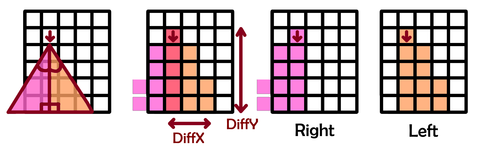

tabulated data can be found in the folder called "diagramsAndTables"

robot model available in "src/my_robot_description"

scripts available in "src/my_robot_bringup/scripts" - key scripts are line_follower.py and ultrasonic_sweep.py

world textures in "src/my_robot_bringup/world/textures"

ROS2 Jazzy Jalisco, Gazebo Harmonic v8

Additional diagram to help explain the cone creation segment of calculateProbabilities():

